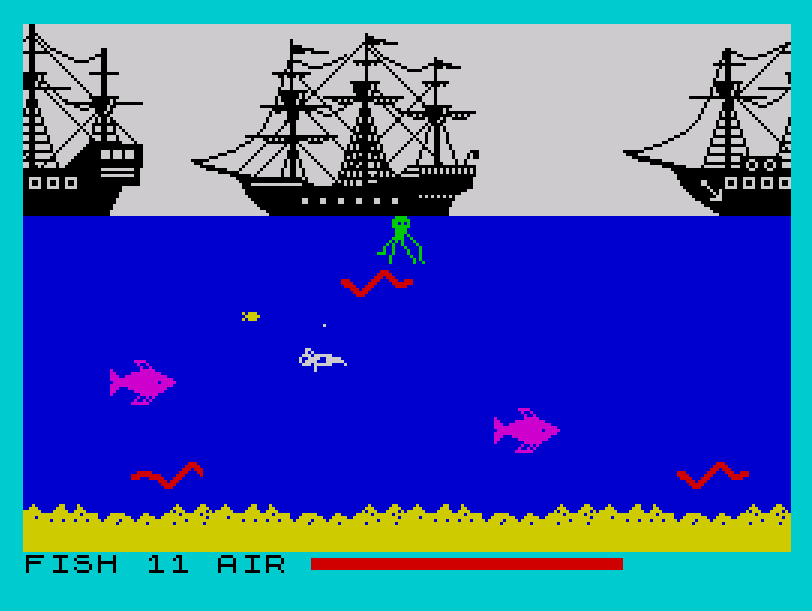

# PicoDiver

**8-Bit Diving Game Demake**

A demake of the secret "Booty" easter-egg game, originally created by John F. Cain for the ZX Spectrum in 1984. Recreated by Nate Taylor for the Pico-8, 2018.

“You play again as Jim the Cabin Boy, but your mission this time is to dive under the pirate ships floating above you, collecting 20 goldfish before your oxygen runs out. Luckily, you can get up to the surface to get some more air, and you can't actually die in this mini-game, but colliding with the fishes and other underwater lifeforms will make you lose all your goldfish.”

Changes include -

* Multiple lives
* Arcade mode with multiple levels and sharks
* Changed resolution and platforms

As referenced here:

* [Booty Hidden Game Review](http://zxplanet.emuunlim.com/booty_hidden_game.htm)
* [Booty retro Game Review](http://frgcb.blogspot.com/2014/01/booty-firebird-1984.html)
* [Youtube Secret Game Video](https://youtu.be/KDIvw0_y7qQ)
* [Playable Booty Hidden Game](https://archive.org/details/zx_Booty_Hidden_Game_1984_Firebird_Software)

